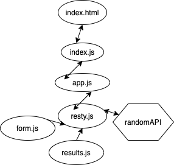

# LAB - Class 24

## RESTy

### Randee Orion

### Links and Resources
- [Submission PR](
)
- [CodePen Code]()
- [CodePen Live]()

### How to initialize / run
Click on the CodePen Live link for a hosted version of the lab. 
Click on the CodePen Code link for access to the code. 

### UML

This project was bootstrapped with [Create React App](https://github.com/facebook/create-react-app).

## Available Scripts

In the project directory, you can run:

### `npm start`

Runs the app in the development mode. 
Open [http://localhost:3000](http://localhost:3000) to view it in the browser.

The page will reload if you make edits. 
You will also see any lint errors in the console.

### `npm test`

Launches the test runner in the interactive watch mode. 
See the section about [running tests](https://facebook.github.io/create-react-app/docs/running-tests) for more information.

